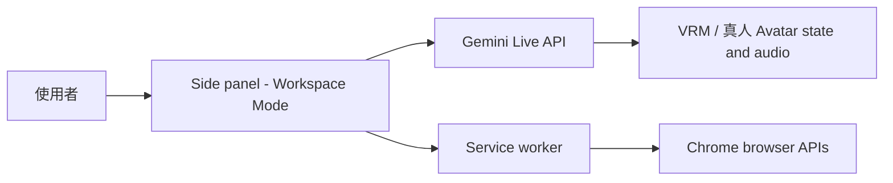

# PageAsk

PageAsk 是以 Chrome Manifest V3 Side Panel 為主要工作區的 Gemini Live 擴充功能。它可以把目前網頁、使用者選取的內容或本機檔案轉成參考來源，進行可插話的即時語音／文字對談；也可以在陪伴模式中使用本機長期記憶。

本專案已在 PageAsk 內整合 VRM Avatar 與可選的 AvatarTrueMan 真人 2D Avatar，不需要另外安裝或發布 PageAskVRM。Side panel 是完整工作區，字幕直接疊在 Avatar 下緣，不會壓縮模型顯示區。

## 主要功能

- 閱讀模式：使用網頁區塊、右鍵反白文字或本機檔案作為對談來源
- 本機來源支援 PDF、TXT、Markdown、CSV 與 JSON；檔案先在瀏覽器內抽取文字
- 陪伴模式：不需要來源即可開始對談
- Gemini 3.8 Live 雙向語音、文字輸入、雙方字幕、VAD、插話、session resumption 與重連
- Side panel 內可切換 VRM 或 AvatarTrueMan 真人 2D Avatar；兩者都支援表情、待機動作與 lip-sync，VRM 另支援骨骼手勢
- Google Search grounding 與非同步 YouTube 影片分析
- 陪伴人格可編輯；長期記憶可新增、編輯、刪除、鎖定與會後整理
- 對談歷史紀錄：搜尋、展開逐字稿、釘選、刪除與匯出 Markdown
- 純文字模式：不申請麥克風也能使用 Live 文字輸入與字幕
- 分享畫面：對談中以 Chrome 原生選擇器分享分頁、視窗或螢幕，每秒送一張 JPEG 給 Live
- Side panel 內顯示 tool feed、grounding 來源、YouTube 結果與瀏覽器工具結果
- 瀏覽器工具：分頁、歷史紀錄、書籤、Reading List、下載狀態
- 會改變瀏覽器狀態的操作一律先顯示確認卡片

## 使用介面與 session 行為

Side panel 統一管理語音、字幕、Avatar、來源、設定、歷史紀錄與工具確認。

- Avatar 預設使用 VRM；可在「設定 → 真人模式」切換至 AvatarTrueMan 真人照片模式。沒有進行中的對談時，儲存設定後會立即切換。

- 語音模式使用麥克風與 VAD；啟用「純文字模式」時不會建立麥克風擷取，只使用 Live 文字輸入與字幕。
- Live session 使用 context window compression（25,000 tokens 觸發、sliding window 目標 8,000 tokens）、session resumption 與 GoAway/斷線重連。
- 純文字回應若停在明顯未完成的句子，client 會自動要求最多兩次續接；語音模式則維持一般 turn 完成流程。
- 表情與動作工具只控制角色，不列入工具 feed 或口語回覆；grounding、YouTube 與瀏覽器工具結果才會顯示在工具區。
- 結束對談時會保存逐字稿歷史；陪伴模式若啟用記憶，會再以 `gemini-3.8-flash` 整理未鎖定記憶。

## 系統架構



主要責任邊界如下：

- `sidepanel.js`：主產品介面、Live session、音訊、記憶、工具 feed 與確認 UI
- `background.js`：執行 Chrome API、開啟 side panel、處理 runtime message
- `js/gemini.js`：Gemini Live WebSocket、非同步 function calling、grounding、YouTube 與工具回應排程
- `js/audio.js`：麥克風 AudioWorklet、PCM 音訊輸入、音訊播放與輸出分析器
- `js/screen-share.js`：getDisplayMedia 畫面擷取、縮圖與 JPEG 影格
- `js/file-parser.js`：PDF.js 與文字檔解析
- `js/history.js` / `js/memory.js`：歷史紀錄與陪伴記憶的清理、上限、匯出與整理
- `js/avatar/`：Three.js／VRM、真人 2D Canvas 載入、表情、手勢、狀態機與 lip-sync
- `js/browser-tools.js`：瀏覽器工具宣告、權限清單、安全 URL 驗證與 mutation 分類

Live client 不直接呼叫 Chrome API。瀏覽器操作集中在 service worker，網頁區塊選取由 content picker 處理，side panel 負責顯示結果與要求確認。

## Gemini 與工具

### 核心工具

| Tool | 用途 | 執行方式 |
| --- | --- | --- |
| `ground_with_google_search` | 以 Google Search 補充即時來源 | Gemini 2.5 Flash，結果以 `WHEN_IDLE` 回傳 |
| `analyze_youtube_video` | 分析公開 YouTube 影片與指定時間片段 | Gemini 3.8 Flash，非同步執行 |
| `set_avatar_emotion` | 設定 Avatar 情緒 | `NON_BLOCKING`，不阻塞語音 |
| `play_avatar_gesture` | 播放 Avatar 手勢 | `NON_BLOCKING`，不阻塞語音 |

### Side panel Workspace Tools

使用者在 side panel 按下「啟用瀏覽器工具」並同意 optional permissions 後，才會把以下工具宣告提供給 Gemini：

- 查詢：`list_open_tabs`、`search_history`、`search_bookmarks`、`list_reading_list`、`list_downloads`
- 可能改變狀態：`activate_tab`、`add_bookmark`、`add_to_reading_list`、`download_file`、`navigate_tab`、`close_tab`

所有 mutation tool 都會先在 side panel 顯示目標與允許／拒絕按鈕。拒絕或取消時只回傳取消結果，不會執行 Chrome API。

## 技術棧

| 類別 | 技術 | 版本或設定 | 用途 |
| --- | --- | --- | --- |
| Extension | Chrome Manifest V3 | Chrome 120+ | Side Panel、service worker、optional permissions |
| Live model | `gemini-3.8-live` | 固定 allowlist | 即時雙向語音與文字對談 |
| Search model | `gemini-2.5-flash` | 固定設定 | Google Search grounding |
| Auxiliary model | `gemini-3.5-flash-lite` | 固定設定 | YouTube 分析與記憶整理 |
| 3D | Three.js | `^0.178.0` | WebGL 場景、動畫與音訊視覺化 |
| VRM | `@pixiv/three-vrm` | `^3.4.0` | 載入與更新 VRM Avatar |
| 真人 Avatar | Canvas 2D + 本機 PNG 圖層 | AvatarTrueMan manifest | 真人照片表情、嘴型、眨眼與呼吸動畫 |
| File parsing | PDF.js、OpenCC | vendor 目錄內嵌 | PDF 文字抽取與簡體轉臺灣繁體中文 |
| Build | Vite | `^7.1.5` | 打包 side panel 與 service worker |
| Test | Node.js test runner | Node.js 20.19+ 或 22.12+ | 單元與靜態驗證 |

## 安裝與建置

Vite 會解析 Three.js 與 VRM 的 bare module imports，因此 Chrome extension 必須載入建置後的 `dist`，不要直接載入專案根目錄。

### 1. 安裝依賴並驗證

```powershell
cd D:\SideProject\PageAsk
npm ci
npm test
npm run check
```

### 2. 建置 extension

```powershell
npm run build
```

`npm run check` 只驗證 Vite build；`npm run build` 會再執行 `scripts/copy-static.mjs`，把 manifest、content picker、vendor、圖示與 VRM 資產複製到建置結果。建置結果位於：

```text
dist/
```

### 3. 載入 Chrome

1. 開啟 `chrome://extensions/`。
2. 啟用「開發人員模式」。
3. 點擊「載入未封裝項目」。
4. 選擇專案下的 `dist/`。
5. 開啟 PageAsk side panel，在設定中輸入 Gemini API key，使用「測試並儲存」。

修改程式後重新執行 `npm run build`，再回到 `chrome://extensions/` 按下 extension 的重新載入按鈕。

## 權限

### 安裝時必要權限

- `storage`：保存設定、記憶、歷史紀錄與 session source
- `sidePanel`：提供主工作區
- `activeTab`、`scripting`：支援使用者明確要求時對目前頁面注入區塊選取器
- `contextMenus`：提供反白文字右鍵選單
- Gemini API host permission：連線至 Gemini Live 與輔助模型

### 使用時才要求的 optional permissions

- `tabs`：讀取與切換分頁
- `history`：搜尋瀏覽歷史
- `bookmarks`：搜尋與建立書籤
- `readingList`：讀取與加入 Reading List
- `downloads`：查詢與啟動下載
- `http://*/*`、`https://*/*`：只在使用者按下「選取網頁區塊」時取得頁面 host access

權限請求只由 side panel 的使用者操作觸發，不會由 Gemini tool 自動申請。Chrome 內建頁面、擴充功能頁面與 Chrome Web Store 不允許注入區塊選取器。

## 資料與隱私

- API key 未加密保存在 `chrome.storage.local`，只適合個人裝置使用。
- 目前來源保存在 `chrome.storage.session`，Chrome 重啟後會清除。
- Side panel 隱藏或卸載時，若沒有進行中的對談／記憶整理，暫存來源與當前字幕會清除；歷史、設定與長期記憶不受影響。
- 陪伴模式長期記憶、歷史紀錄與設定保存在本機 extension storage。
- 原始檔案會先在瀏覽器本機抽取文字，不會上傳至 Gemini Files API；抽取結果才會送往 Gemini。
- 字幕、音訊、grounding 工作與 Live session handle 只存在記憶體；逐字稿在使用者結束對談後才用於歷史紀錄與記憶整理。
- 瀏覽器 tools 只在使用者授權後啟用；會改變瀏覽器狀態的操作仍需要逐項確認。

## 專案結構

```text
PageAsk/
├── background.js                 # MV3 service worker 與 Chrome API
├── content-picker.js              # 網頁區塊選取器
├── sidepanel.html / sidepanel.js # 主工作區
├── styles.css                    # Side panel 樣式
├── js/
│   ├── constants.js              # 模型、聲線、storage 與來源 token 上限
│   ├── gemini.js                 # Gemini Live 與非同步 tools
│   ├── audio.js                  # 麥克風與音訊播放
│   ├── audio-capture-worklet.js  # 麥克風 AudioWorklet
│   ├── screen-share.js           # 分享畫面影格擷取
│   ├── file-parser.js             # PDF、文字、JSON 來源解析
│   ├── history.js                # 對談歷史建立、搜尋與匯出
│   ├── memory.js                 # 記憶 token 預算與會後整理
│   ├── transcript.js              # 串流字幕合併與工具回覆過濾
│   ├── traditional-chinese.js    # 簡體中文 STT 轉換
│   ├── browser-tools.js          # 瀏覽器 tools 宣告與安全驗證
│   ├── source.js                 # 來源標準化與上限
│   ├── storage.js                # settings、memory、history、source
│   ├── avatar/
│   │   ├── emotions.js           # Avatar 情緒 tool
│   │   ├── gestures.js           # Avatar 手勢 tool 與動作播放器
│   │   ├── lip-sync.js            # 音訊輸出分析與 viseme
│   │   ├── state-machine.js       # idle/listening/thinking/speaking 狀態
│   │   ├── true-man-avatar-controller.js # 真人 2D Canvas controller
│   │   └── vrm-avatar-controller.js # Three.js / VRM controller
├── avatars/sha.vrm               # 預設 Avatar 資產
├── avatars/true-man/              # 真人模式 manifest 與 PNG 圖層
├── scripts/copy-static.mjs       # 複製 manifest、vendor 與資產至 dist
├── vite.config.js                # Vite 多 entry build 設定
├── tests/                        # Node.js tests
├── vendor/                       # PDF.js、OpenCC 與第三方授權檔
└── dist/                         # npm run build 產物，不納入版本控制
```

## 限制

- 需要 Chrome 120+；Reading List API 從 Chrome 120 開始支援。
- 單一檔案上限 10 MiB；來源另有 60,000 Unicode 字元的絕對防護上限。
- 來源會以 token 估算控管：約 16,000 tokens 起顯示長來源警告，最多保留約 20,000 tokens。
- VRM 模式需要 WebGL；真人模式會額外載入約 19.5 MiB 的本機 PNG 圖層。任一 Avatar 載入失敗時，Live 語音／文字功能仍可使用。
- 目前不支援 Office 檔案、OCR、圖片／影音檔案來源、多來源累加與雲端記憶同步。
- 直接關閉 side panel 或瀏覽器不會保證建立歷史紀錄，也不會執行未完成的會後記憶整理。

## 測試

需要 Node.js 20.19+ 或 22.12+：

```powershell
cd D:\SideProject\PageAsk
npm test
npm run check
npm run build
```

測試涵蓋：

- PCM 音訊轉換、AudioWorklet 與文字模式
- 檔案解析、PDF 頁序、來源大小與 URL 驗證
- Gemini 3.8 Live setup、VAD、compression、resumption、重連與 `NON_BLOCKING` tools
- grounding、YouTube、`WHEN_IDLE` function response 與取消流程
- Avatar tools 靜默執行、字幕工具資訊過濾
- optional permissions、瀏覽器工具安全 URL 與 mutation confirmation
- history、memory、settings migration、字幕串流合併與繁體中文轉換
- Vite build 後 manifest、entry points 與 web-accessible resources

## 常見問題

### 為什麼要載入 `dist`，不能直接載入 PageAsk 根目錄？

原始碼使用 Vite 解析 Three.js 與 VRM module。`npm run build` 會將 module、HTML、service worker 與靜態資產整理成 Chrome 可直接載入的 `dist`。

### 為什麼看不到歷史、書籤或下載工具？

這些屬於 optional permissions。請在 side panel 按下「啟用瀏覽器工具」並允許對應權限；未授權時不會把這些 tools 宣告給 Gemini。

### 為什麼新增書籤、下載或關閉分頁前還要再確認？

這些操作會改變瀏覽器狀態。PageAsk 會先顯示確認卡片，只有使用者按下允許後，service worker 才會呼叫 Chrome API。

### Avatar 載入失敗時還能使用 PageAsk 嗎？

可以。VRM controller 會將錯誤顯示在 Avatar stage，Live 的語音、文字、字幕與工具功能仍可使用。

### 哪些本機檔案可以加入閱讀來源？

目前支援 PDF、TXT、Markdown、CSV 與 JSON。PDF 只抽取可選取的文字；掃描影像、OCR、Office 檔案與圖片／影音檔案尚未支援。

## 相關資源

- [Gemini Live API tools](https://ai.google.dev/gemini-api/docs/live-api/tools)
- [Gemini Live API](https://ai.google.dev/gemini-api/docs/live)
- [Chrome Side Panel API](https://developer.chrome.com/docs/extensions/reference/api/sidePanel)
- [Chrome Permissions API](https://developer.chrome.com/docs/extensions/reference/api/permissions)
- [Chrome Reading List API](https://developer.chrome.com/docs/extensions/reference/api/readingList)
- [Three.js](https://threejs.org/docs/)
- [@pixiv/three-vrm](https://github.com/pixiv/three-vrm)
